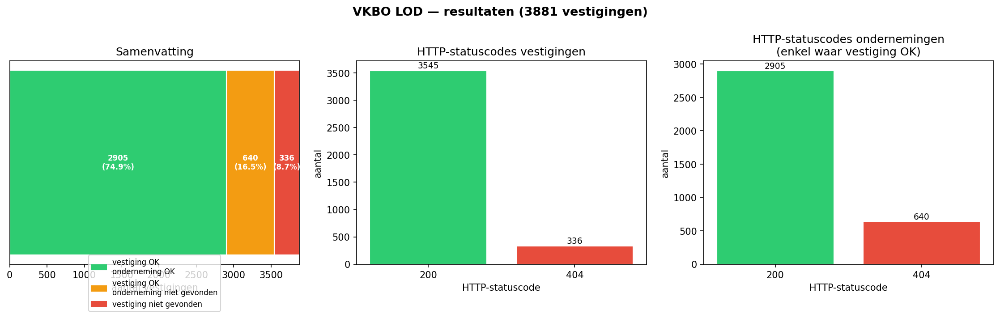

# Verslag: Linked Data Publicatie VKBO — Dereference- en Content Negotiation-test

**Datum:** 2026-04-30  
**Project:** VKBO-LOD-TEST  
**Auteur:** Geert Van Haute

---

## 1. Context en doelstelling

Het VKBO (Vlaamse KruispuntBank van Ondernemingen) publiceert vestigings- en ondernemingsgegevens als linked data via `https://data.vlaanderen.be`. Het IMJV (Integraal Milieujaarverslag) verwijst via `rdfs:seeAlso` naar vestigingen in de (verouderde) KBO-datanamespace (`http://data.kbodata.be/organisation/...`).

Het doel van deze test is na te gaan in welke mate de omgezette VKBO-URI's:

1. correct gedereferenceerd kunnen worden (HTTP 200);
2. content negotiation ondersteunen voor `text/turtle`;
3. een geldige `org:siteOf`-link naar de bijhorende onderneming bevatten die ook gedereferenceerd kan worden.

---

## 2. Brondata

De lijst van te testen vestiging-URI's werd samengesteld via een SPARQL-query op het IMJV-endpoint:

**Endpoint:** `https://data.imjv.omgeving.vlaanderen.be/sparql`

```sparql
PREFIX rdfs: <http://www.w3.org/2000/01/rdf-schema#>
PREFIX imjv: <https://data.imjv.omgeving.vlaanderen.be/ns/imjv#>

SELECT ?o ?nieuweURI
WHERE {
  ?s a imjv:ExploitatieStaat ;
     rdfs:seeAlso ?o .

  FILTER(STRSTARTS(STR(?o), "http://data.kbodata.be/organisation"))

  BIND(
    IRI(
      CONCAT(
        "https://data.vlaanderen.be/id/vestiging/",
        REPLACE(
          REPLACE(STR(?o), "^http://data.kbodata.be/organisation/", ""),
          "_|#id", ""
        )
      )
    ) AS ?nieuweURI
  )
}
```

De query selecteert alle `imjv:ExploitatieStaat`-instanties met een `rdfs:seeAlso`-link naar `data.kbodata.be` en transformeert die naar de nieuwe VKBO-namespace (`https://data.vlaanderen.be/id/vestiging/`). Dit leverde **3.881 unieke vestiging-URI's** op, opgeslagen in `sources/vestigingen.csv`.

---

## 3. Methode

De test werd uitgevoerd met een Python-script (`scripts/check_vestigingen.py`) dat gebruik maakt van de bibliotheek `httpx` voor HTTP-requests en `rdflib` voor het parsen van Turtle.

Per vestiging-URI werd het volgende gecontroleerd:

1. **Dereference vestiging** — GET-request met `Accept: text/turtle`; verwacht HTTP 200.
2. **Content negotiation** — response geparsed als Turtle via `rdflib`; verwacht geldige RDF-graaf.
3. **Linked onderneming** — `org:siteOf`-triple geëxtraheerd uit de payload; de gevonden onderneming-URI werd eveneens gedereferenceerd met `Accept: text/turtle`.

De resultaten werden weggeschreven naar `resultaat.csv`.

---

## 4. Resultaten

| Categorie | Aantal | Aandeel |
|---|---:|---:|
| Vestiging OK + onderneming OK | 2.905 | 74,9% |
| Vestiging OK, onderneming niet gevonden (404) | 640 | 16,5% |
| Vestiging niet gevonden (404) | 336 | 8,7% |
| **Totaal** | **3.881** | **100%** |



### 4.1 Vestigingen

- **3.545 vestigingen** (91,3%) zijn bereikbaar en leveren geldige Turtle af.
- **336 vestigingen** (8,7%) geven een HTTP 404. Deze URI's zijn afgeleid uit de IMJV-data maar lijken (nog) niet gepubliceerd in de VKBO linked data-publicatie.

### 4.2 Ondernemingen (via `org:siteOf`)

Van de 3.545 bereikbare vestigingen bevatten alle een `org:siteOf`-link naar een onderneming.

- **2.905 ondernemingen** (81,9% van de bereikbare vestigingen) zijn ook bereikbaar en leveren geldige Turtle af.
- **640 ondernemingen** (18,1%) geven een HTTP 404. De vestiging is dus correct gepubliceerd, maar de gelinkte onderneming ontbreekt. Voorbeelden:
  - `https://data.vlaanderen.be/id/onderneming/0449296278`
  - `https://data.vlaanderen.be/id/onderneming/0682158735`
  - `https://data.vlaanderen.be/id/onderneming/0743339110`

---

## 5. Bevindingen

### 5.1 Globale dekkingsgraad
74,9% van de via IMJV gerefereerde vestigingen is volledig operationeel in de VKBO linked data-publicatie. Voor 25,1% is er een probleem dat de linked data-keten verbreekt.

### 5.2 Ontbrekende vestigingen (8,7%)
336 vestiging-URI's kunnen niet gedereferenceerd worden. Mogelijke oorzaken:
- De vestiging is ondertussen stopgezet en uit de publicatie verwijderd.
- De URI-transformatie van `data.kbodata.be` naar `data.vlaanderen.be/id/vestiging/` is niet altijd correct (bv. door een ander nummerformaat).

### 5.3 Ontbrekende ondernemingen (16,5%)
640 vestigingen bevatten een `org:siteOf`-link naar een onderneming die een 404 geeft. Dit wijst op een **interne inconsistentie** in de VKBO linked data-publicatie: de vestiging is gepubliceerd, maar de bijhorende onderneming niet. Dit verbreekt de navigatie langs de linked data-graaf.

### 5.4 Content negotiation
Alle bereikbare URI's (3.545 vestigingen + 2.905 ondernemingen) leverden correct `text/turtle` af als response op een request met `Accept: text/turtle`. Content negotiation werkt dus correct voor de gepubliceerde resources.

---

## 6. Aanbevelingen

1. **Onderzoek de 336 ontbrekende vestigingen** — controleer of de URI-transformatie correct is en of deze vestigingen bewust niet gepubliceerd zijn.
2. **Herstel de 640 gebroken ondernemingslinks** — een vestiging die een `org:siteOf`-link bevat naar een niet-bestaande onderneming is een data-kwaliteitsprobleem. De onderliggende onderneming dient gepubliceerd te worden of de link dient verwijderd te worden.
3. **Opnemen in IMJV-datavalidatie** — voeg een periodieke dereference-check toe als kwaliteitscontrole bij het verwerken van IMJV-data, zodat gebroken links vroeg gesignaleerd worden.
4. **Uitbreiden met performantietesten** — een vervolgfase zal de responstijden en schaalbaarheid van de VKBO linked data-endpoints meten via Locust.
